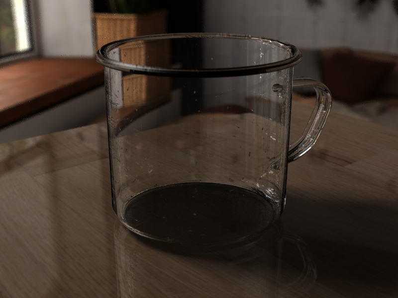
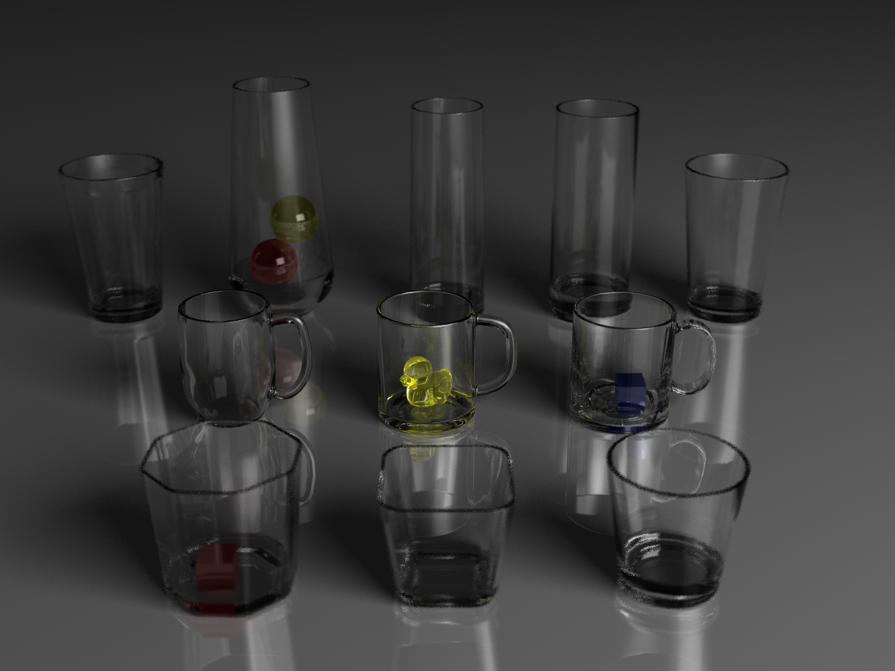
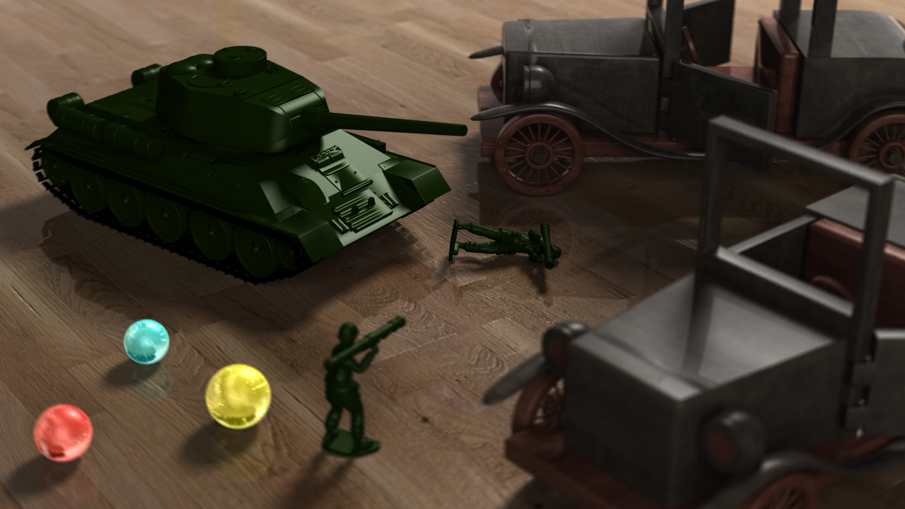
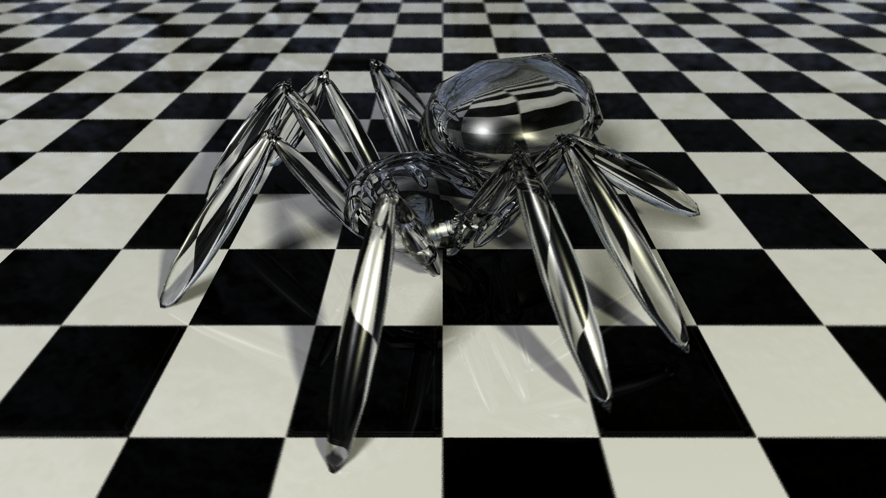

# RayDream
A photorealistic raytracer and editor designed to create stunning rendered images with ease and flexibility. Featuring an intuitive interface for editing objects, importing models, and adjusting raytracer settings.


## Features

- **Photorealistic Rendering:** High-quality raytracing for realistic lighting, shadows, and reflections.
- **Acceleration Structures:**
  - **Bounding Volume Hierarchies (BVH):** Speeds up rendering by optimizing object intersections.
  - **Adaptive Supersampling:** Enhances image quality by dynamically refining pixel sampling in detailed areas.
  - **Multithreading:** Leverages multiple CPU cores for faster rendering.
- **GUI and Editing:**
  - **Object Editing:** Modify object properties such as position, rotation, scale, and material.
  - **Settings Panel:** Adjust rendering parameters like resolution, recursion depth, and lighting settings.
  - **Model Import:** Load and integrate OBJ models, complete with support for:
    - **Textures:** Apply image-based materials to models.
    - **Bump Mapping:** Add surface detail for increased realism.

## Images Rendered with RayDream

<div style="text-align: center;"></div>







## Getting Started
### Prerequisites:
- Apache Maven
- Java JDK 22 or greater
- A system that supports OpenGL and the latest graphics drivers installed

### Compile and Run

1. Clone the repository:

    ```bash
    git clone https://github.com/JacksonHoggard/raydream.git
    cd raydream
    ```

2. Compile the program:

    `mvn clean package`

3. Once the program has finished compiling, either double click on the `raydream-jar-with-dependencies.jar` file in the newly created target folder, or run the following commands to run the program:

    ```bash
    cd target/
    java -jar raydream-jar-with-dependencies.jar
    ```

## Contributions

Contributions to RayDream are welcome! Whether you want to fix bugs, add new features, or improve documentation, your contributions are greatly appreciated. Just fork the repository, make your changes, and submit a pull request.

## License

This project is licensed under the [MIT License](LICENSE).

## Acknowledgments

Resources used for this project:
* [Raytracing CS148 Stanford](https://graphics.stanford.edu/courses/cs148-10-summer/as3/instructions/as3.pdf)
* [Koto's Stack Overflow Comment](https://stackoverflow.com/a/33091767)
* [Phong Illumination Model Cheat Sheet](http://rodolphe-vaillant.fr/entry/85/phong-illumination-model-cheat-sheet)
* [Overview of the Ray-Tracing Rendering Technique](https://www.scratchapixel.com/lessons/3d-basic-rendering/ray-tracing-overview/light-transport-ray-tracing-whitted.html)
* [Ray Tracing in One Weekend](https://raytracing.github.io/books/RayTracingInOneWeekend.html)
* [The Nim Ray Tracer Project - Part 4: Calculating Box Normals](https://blog.johnnovak.net/2016/10/22/the-nim-ray-tracer-project-part-4-calculating-box-normals/)
* [Fresnel Term Approximation for Metals](http://cg.iit.bme.hu/~szirmay/fresnel.pdf)
* [Ray Tracer Challenge: Texture Mapping](http://raytracerchallenge.com/bonus/texture-mapping.html)
* [Ray-plane Intersection Princeton Slide](https://www.cs.princeton.edu/courses/archive/fall00/cs426/lectures/raycast/sld017.htm)
* [Scratchapixel: Ray-Tracing: Rendering a Triangle](https://www.scratchapixel.com/lessons/3d-basic-rendering/ray-tracing-rendering-a-triangle/barycentric-coordinates.html)
* [Graphics Compendium Raytracing Chapter 34: Transformations](https://graphicscompendium.com/raytracing/12-transformations)
* [Jacco's Blog](https://jacco.ompf2.com/2022/04/13/how-to-build-a-bvh-part-1-basics/)
* [The University of Utah CS 6958 Lecture 8](https://my.eng.utah.edu/~cs6958/slides/Lec8_2.pdf)
* [The University of Utah Advanced Ray Tracing lecture](https://my.eng.utah.edu/~cs4600/lectures/Wk13_AdvancedRayTracing.pdf)
* [Karadeniz Technical University: Texture Mapping](https://ceng2.ktu.edu.tr/~cakir/files/grafikler/Texture_Mapping.pdf)
* [Bump Mapping - CS384G Computer Graphics Final Project](https://pathtracing.home.blog/bump-mapping/)