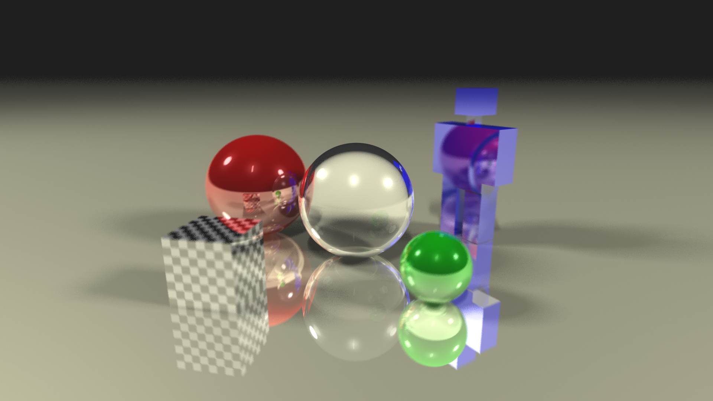

# 💡 RayDream: Java Ray Tracer

A simple yet powerful ray tracer implemented in Java. RayDream creates realistic images by simulating the behavior of light rays as they interact with objects in a scene.



## Features

- **Ray Tracing Basics:** Implements fundamental ray tracing algorithms, including ray-object intersection, reflection, refraction, and shading.
- **Scene Description:** Define scenes by programmatically constructing objects and lights.
- **Support for Basic Shapes:** Supports rendering of basic geometric shapes such as spheres and boxes.
- **Model Support:** Supports rendering of models in the wavefront obj format.
- **Materials and Textures:** Assign materials and textures to objects to add realism to a scene.
- **Antialiasing:** Reduces aliasing artifacts with built-in sampling techniques.
- **Parallel Rendering:** Utilizes multi-threading for faster rendering of complex scenes.

## Usage
RayDream is designed to be easy to use while still providing flexibility for advanced users. Here's a basic example of how to render a scene using RayDream:
```java
import light.Light;
import material.*;
import math.Vector3D;
import object.*;
import object.Object;

import java.io.IOException;

public class Main {
    public static void main(String[] args) throws IOException {
        int width = 1920;
        int height = 1080;

        Camera camera = new Camera(
                new Vector3D(-2, 1, 1),
                new Vector3D(0, 0, -2),
                50,
                width,
                height
        );

        Light ambient = new Light(new Vector3D(), new Vector3D(1, 1, 1), 1);
        Light[] lights = {
                new Light(new Vector3D(-10, 10, -10), new Vector3D(1, 1, 1), 10D),
                new Light(new Vector3D(-10, 10, 10), new Vector3D(1, 1, 1), 10D),
                new Light(new Vector3D(10, 10, -10), new Vector3D(1, 1, 1), 10D),
                new Light(new Vector3D(10, 10, 10), new Vector3D(1, 1, 1), 10D)
        };

        Object[] objects = new Object[]{
                new Sphere(new Transform(new Vector3D(0, 0, -2), new Vector3D(0, 0, 0), new Vector3D(1, 1, 1)), 0.5D, new Glass(0.1D, 0.94)),
                new Sphere(new Transform(new Vector3D(-0.5, 0, -3), new Vector3D(0, 0, 0), new Vector3D(1, 1, 1)), 0.5D, new Reflective(new Vector3D(1, 0, 0), 0.1D, 0.6D, 0.6D, 50, 0.2D, 0.617D, 2.63D)),
                new Plane(-0.5, new Vector3D(0, 0, 0), new Reflective(new Vector3D(255 / 255D, 253 / 255D, 208 / 255D), 0.1D, 0.6D, 0.5D, 4, 1, 0.617D, 2.63D))
        };

        Scene scene = new Scene(camera, ambient, lights, objects, width, height);
        scene.render("output.png", 10, 8, 8);
    }
}
```

## Contributions

Contributions to RayDream are welcome! Whether you want to fix bugs, add new features, or improve documentation, your contributions are greatly appreciated. Just fork the repository, make your changes, and submit a pull request.

## License

This project is licensed under the MIT License.

## Acknowledgments

Resources used for this project.
* [Raytracing CS148 Stanford](https://graphics.stanford.edu/courses/cs148-10-summer/as3/instructions/as3.pdf)
* [Koto's Stack Overflow Comment](https://stackoverflow.com/a/33091767)
* [Phong Illumination Model Cheat Sheet](http://rodolphe-vaillant.fr/entry/85/phong-illumination-model-cheat-sheet)
* [Overview of the Ray-Tracing Rendering Technique](https://www.scratchapixel.com/lessons/3d-basic-rendering/ray-tracing-overview/light-transport-ray-tracing-whitted.html)
* [Ray Tracing in One Weekend](https://raytracing.github.io/books/RayTracingInOneWeekend.html)
* [The Nim Ray Tracer Project - Part 4: Calculating Box Normals](https://blog.johnnovak.net/2016/10/22/the-nim-ray-tracer-project-part-4-calculating-box-normals/)
* [Fresnel Term Approximation for Metals](http://cg.iit.bme.hu/~szirmay/fresnel.pdf)
* [Ray Tracer Challenge: Texture Mapping](http://raytracerchallenge.com/bonus/texture-mapping.html)
* [Ray-plane Intersection Princeton Slide](https://www.cs.princeton.edu/courses/archive/fall00/cs426/lectures/raycast/sld017.htm)
* [Scratchapixel: Ray-Tracing: Rendering a Triangle](https://www.scratchapixel.com/lessons/3d-basic-rendering/ray-tracing-rendering-a-triangle/barycentric-coordinates.html)
* [Graphics Compendium Raytracing Chapter 34: Transformations](https://graphicscompendium.com/raytracing/12-transformations)
* [Jacco's Blog](https://jacco.ompf2.com/2022/04/13/how-to-build-a-bvh-part-1-basics/)
* [The University of Utah CS 6958 Lecture 8](https://my.eng.utah.edu/~cs6958/slides/Lec8_2.pdf)